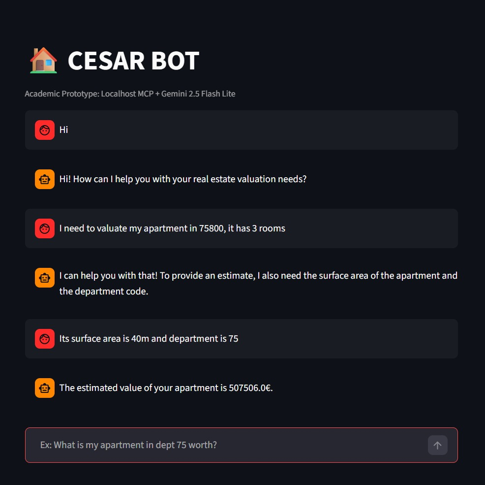

# CESAR - The AI bot that estimates real estate worth

### Context:
This repository is created as part of an academic endeavour to learn to deploy machine learning models in professional setting.
It is owned by:
Joshua Alexander, Monica Nathalie Bertolini and Modhura Das.

For further contribution or ideas of extension contact: joshua.alexander2705@gmail.com

## How does it help and bring value?
Cesar acts as your personal real estate agent!
His sole purpose is to help you make the right decisions by giving you estimate of property price thoroughout France!
You are able to talk to the bot as if chatting with a human without clunky interfaces. 
The underlying CESAR Prediction API doesn't just blindly guess, it uses a random forest ML model trained on extensive dataset for estimation. The bot never gives an estimate without a prior health check to the API.

## Key Features
1. Machine Learning Valuation Model
Trained on the official DVF dataset (French real estate transactions), the model uses a Random Forest model for robust predictions and handles structured tabular data effectively

2. More precise location awareness: our CESAR model introduces the use of commune code as an input feature.

This improves valuation accuracy by capturing local price variations within the same department and enabling more granular and realistic estimates
In practice, two properties in the same department can have very different values, the commune-level input allows CESAR to reflect that.

3. Multiple ways to access the model

Our CESAR model is designed to be used in different contexts to serve both end users and technical teams:
Chatbot → natural interaction, no technical knowledge required
Web UI → simple form for quick estimates
API → integration into external applications
CLI → batch processing and automation

4. Health Monitoring

Our CESAR model includes a /health endpoint to check API availability, prevent failed requests and improve reliability in production environments. This is particularly useful for external systems such as the chatbot.

5. End-to-end pipeline

CESAR is not just a model, but a complete system:
data ingestion
model training
artifact versioning (model + contract)
API serving
user interfaces

## Deployment

The CESAR model has been containerized and deployed in the cloud, allowing it to run independently from any local machine.
This means no setup is required for end users in a consistent execution environment. It also allows for easy scalability.
The chatbot interface is publicly accessible and interacts directly with the deployed API.

## AI usage declaration
- AI was used in the streamlit interface UI and for programming how to store a session history 
- AI tools were used selectively to assist with debugging (e.g., resolving CORS issues and environment configuration)
- AI was used in the rephrasing of sentences for a more clear README and usage intruction document

**This is the link to our chatbot**
   - **Chatbot UI** → https://cesar-chatbot.onrender.com

## Possible Next steps
- Dockerise the MCP and get it running with Kubernetes in Cloud
- Optimize model by removing Department
- Enhance security aspects - CORS
- Manage chat window size (rolling window or summarize)
